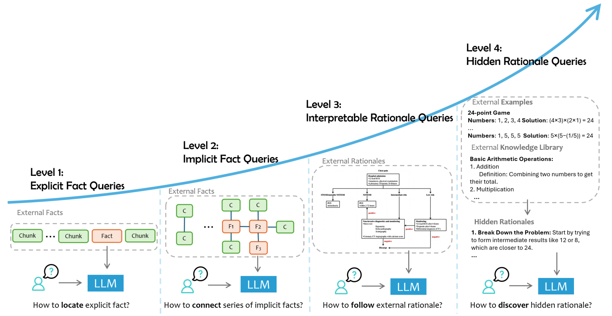

# JCrRAG: Japanese Contextual relevance RAG Benchmark

A human-annotated benchmark for evaluating Japanese Retrieval-Augmented Generation (RAG) systems, featuring multi-level complexity and diverse categories.

## Benchmark Overview

JCrRAG aims to provide a comprehensive benchmark for Japanese RAG systems. It classifies questions into three complexity levels and covers a wide range of categories relevant to Japanese contexts.

### Complexity Levels

Based on the framework from [Zhao et al., 2024](https://arxiv.org/pdf/2409.14924):


- **Level 1: Direct fact retrieval** - Answers can be found directly in a single passage of the context.
- **Level 2: Multi-document synthesis** - Answers require synthesizing information from multiple passages or documents.
- **Level 3: Complex reasoning and inference** - Answers demand deeper reasoning, inference, or addressing hypothetical scenarios based on the context.

### Categories

- History - Geography - Law
- Medical Care - Insurance - Finance
- Internal Regulations - Japanese Culture

## Evaluation Metrics

The RAG systems are evaluated on the following four dimensions:

| Metric       | Description                                                                    |
| ------------ | ------------------------------------------------------------------------------ |
| Faithfulness | Factual consistency of the generated answer with the provided context.         |
| Relevance    | Pertinence of the generated answer to the posed question.                      |
| Completeness | Coverage of all required information elements from the question in the answer. |
| Utilization  | Effective use of contextual evidence in formulating the answer.                |

## Getting Started

### Prerequisites

- Python 3.10+
- pip package manager

### Installation

```bash
git clone https://github.com/ngocnhq/JCrRAG.git
cd JCrRAG
pip install -r requirements.txt
```

### Dataset Preparation
Download the `xlsx` dataset and run the data preparation script:
```bash
python prepare_data.py \
  --input_file path/to/data.xlsx \
  --max_samples 10000 # Maximum samples to process
```
Processed data will be saved to `./data/`

## Model Evaluation

Generate answers from your RAG system using either local models with vLLM or API-based models.

### Local vLLM Models

1.  Generate answers:

    ```bash
    cd gen_answer/
    python gen_answer.py \
       --model_path $MODEL_PATH \
       --api local \
       --tensor_parallel_size $NUM_GPUS \
       --benchmark_name $BENCHMARK_NAME
    ```

    **Script Parameters for `gen_answer.py` (Local vLLM):**

    - `--model_path` (`$MODEL_PATH`): Path to the local Hugging Face model directory or a model identifier from Hugging Face Hub that is compatible with vLLM.
    - `--api`: Must be set to `local` to use vLLM.
    - `--tensor_parallel_size` (`$NUM_GPUS`): The number of GPUs to use for tensor parallelism with vLLM.
    - `--benchmark_name` (`$BENCHMARK_NAME`): The name of the benchmark dataset (e.g., `Level 1`, `Level 2` or `Level 3`) that was processed by `prepare_data.py`. This usually corresponds to the sub-folder name in `./data/`.

### API-based Models

1.  Generate answers (OpenAI-compatible API):

    ```bash
    cd gen_answer/
    python gen_answer.py \
      --benchmark_name $BENCHMARK_NAME \
      --model_path $MODEL_NAME \
      --api api \
      --base-url $API_ENDPOINT \
      --api-key $API_KEY
    ```

    **Script Parameters for `gen_answer.py` (API-based):**

    - `--benchmark_name` (`$BENCHMARK_NAME`): The name of the benchmark dataset (e.g., `Level 1`, `Level 2` or `Level 3`) that was processed by `prepare_data.py`.
    - `--model_path` (`$MODEL_NAME`): The model identifier/name as recognized by the API (e.g., `gpt-4o`, `claude-3-opus-20240229`).
    - `--api`: Must be set to `api` to use an external API.
    - `--base-url` (`$API_ENDPOINT`): The base URL of the OpenAI-compatible API endpoint.
    - `--api-key` (`$API_KEY`): Your API key for authentication with the service.

## Evaluation Judgement

Generate assessment scores for the generated answers using a powerful LLM as a judge (e.g., GPT-4o).

```bash
cd judge/
python gen_judgement.py \
   --model_list $YOUR_MODEL_NAME \
   --judge-models gpt-4o \
   --benchmark_name $BENCHMARK_NAME
```

**Script Parameters for `gen_judgement.py`:**

- `--model_list` (`$YOUR_MODEL_NAME`): A comma-separated string of model names whose generated answers you want to evaluate. These names should correspond to the output files/folders created by `gen_answer.py`.
- `--judge-models`: The model(s) to be used as the judge. Currently, `gpt-4o` is supported. You can specify one or more judge models, comma-separated.
- `--benchmark_name` (`$BENCHMARK_NAME`): The name of the benchmark dataset (e.g., `Level1`, `Level2` or `Level3`) for which the judgements are to be generated.

## Demo Results (Leaderboard)

Below are illustrative results. The table shows scores for each model as judged by two different LLMs: **gpt-4o** and **o3-mini**. Scores represent the average across the four metrics (Faithfulness, Relevance, Completeness, Utilization) for each complexity level.

| Model                                             | Judge: gpt-4o |         |         |         | Judge: o3-mini |         |         |         |
| ------------------------------------------------- | :-----------: | :-----: | :-----: | :-----: | :------------: | :-----: | :-----: | :-----: |
|                                                   |    Level 1    | Level 2 | Level 3 | Average |    Level 1     | Level 2 | Level 3 | Average |
| LHTM-OPT3                                         |     7.95      |  7.65   |  7.63   |  7.74   |      7.77      |  7.18   |  7.04   |  7.33   |
| DeepSeek-V3                                       |     7.96      |  7.65   |  7.52   |  7.71   |      7.80      |  7.05   |  6.88   |  7.24   |
| Qwen2.5-72B-Instruct                              |     7.92      |  7.56   |  7.53   |  7.67   |      7.79      |  6.94   |  6.86   |  7.20   |
| Llama-3.3-70B-Instruct                            |     7.87      |  7.55   |  7.22   |  7.55   |      7.79      |  7.12   |  6.68   |  7.19   |
| gpt-4o                                            |     7.92      |  7.56   |  7.49   |  7.66   |      7.82      |  6.88   |  6.84   |  7.18   |
| gemma-3-27b-it                                    |     7.87      |  7.41   |  7.03   |  7.44   |      7.71      |  6.58   |  6.92   |  7.07   |
| tokyotech-llm/Llama-3.3-Swallow-70B-Instruct-v0.4 |     7.83      |  7.31   |  6.83   |  7.32   |      7.70      |  6.71   |  6.03   |  6.81   |
| tokyotech-llm/Llama-3.1-Swallow-70B-Instruct-v0.3 |     7.78      |  7.24   |  6.70   |  7.24   |      7.61      |  6.58   |  5.87   |  6.68   |
| LHTM-OPT-2.0                                      |     7.59      |  6.98   |  5.77   |  6.78   |      7.37      |  6.20   |  4.50   |  6.02   |

_Note: The 'Average' columns show the average score across all three complexity levels for that model, as evaluated by the respective judge model._

## ⚠️ Important Note  

Evaluation via vLLM is limited to models currently supported by vLLM. You can verify compatibility at [vLLM Supported Models](https://docs.vllm.ai/en/latest/models/supported_models.html). For models not supported by vLLM, please load them directly from Hugging Face. Additionally, for newly released models such as Qwen3 (as of May 2025), ensure you update your vLLM library to the latest version to support these models.

```

```
